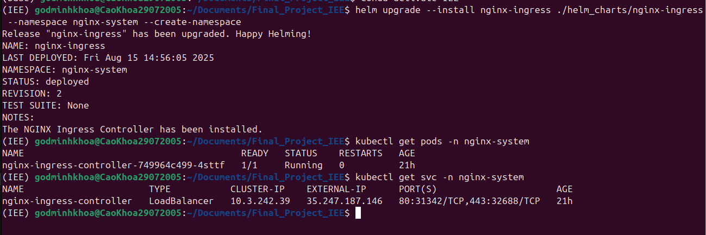
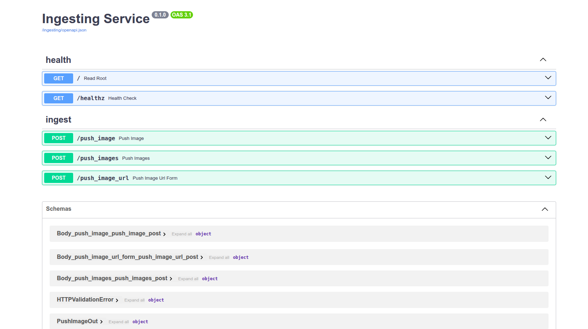
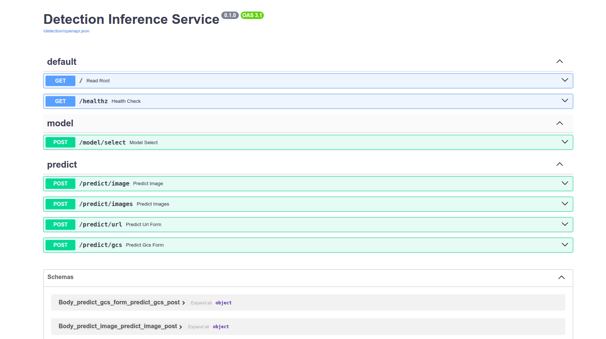
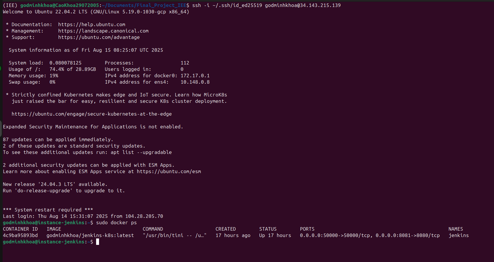
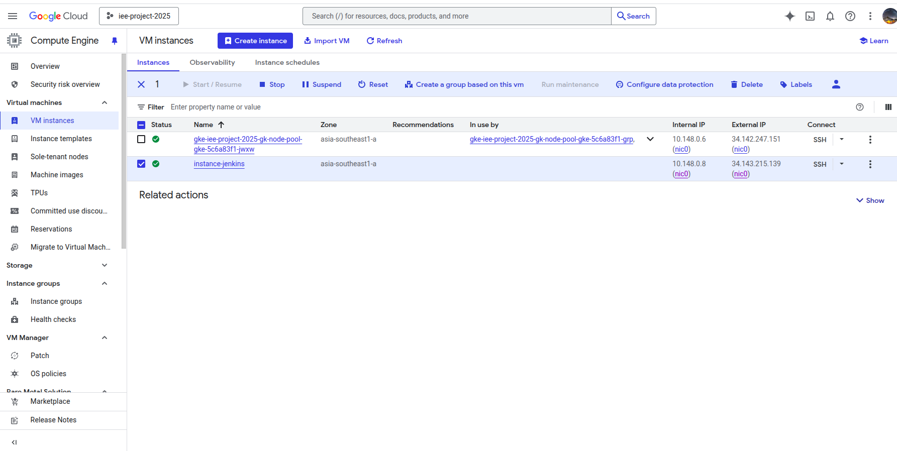
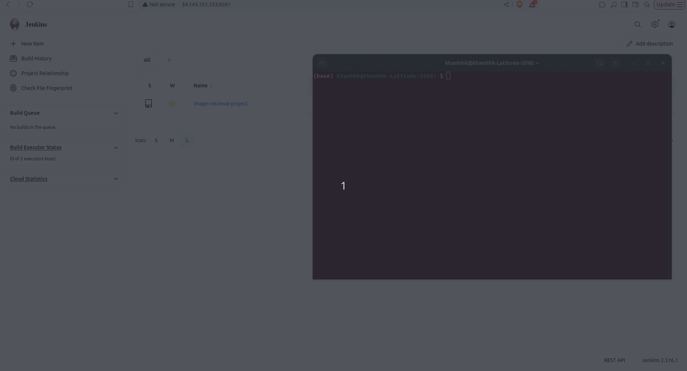
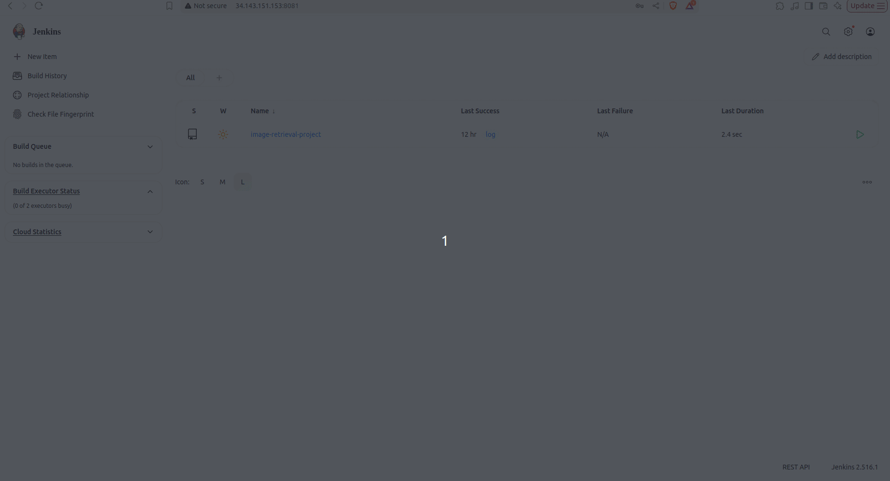
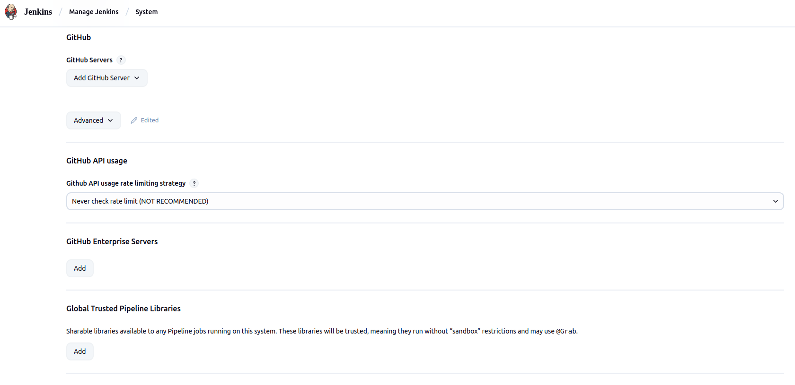
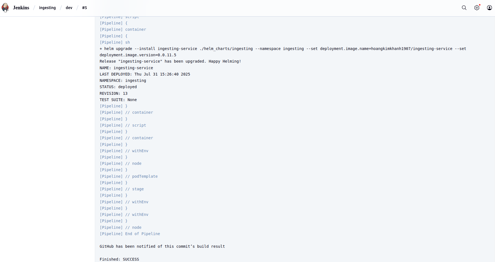

# Traffic-Sign-Detection
## System Architecture

## Technology
* Source control: [![Git/Github][Github-logo]][Github-url]
* CI/CD: [![Jenkins][Jenkins-logo]][Jenkins-url]
* Build API: [![FastAPI][FastAPI-logo]][FastAPI-url]
* Containerize application: [![Docker][Docker-logo]][Docker-url]
* Container orchestration system: [![Kubernetes(K8s)][Kubernetes-logo]][Kubernetes-url]
* K8s's package manager: [![Helm][Helm-logo]][Helm-url]
* Data Storage for images: [![Google Cloud Storage][Google-Cloud-Storage-logo]][Google-Cloud-Storage-url]
* Ingress controller: [![Nginx][Nginx-logo]][Nginx-url]
* Deliver infrastructure as code: [![Ansible][Ansible-logo]][Ansible-url] [![Terraform][Terraform-logo]][Terraform-url]
* Cloud platform: [![GCP][GCP-logo]][GCP-url]

## Project Structure

```
Final_Project_IEE/
├── app/               # Prediction service
│   ├── models/
│   ├── results/
│   ├── routers/
│   ├── schemas/
│   ├── services/
│   ├── config.py
│   ├── main.py
│   └── Dockerfile
│
├── helm_charts/       # Helm deployment
│   ├── ingesting/
│   ├── nginx-ingress/
│   └── predict/
│
├── iac/               # Infrastructure as Code
│   ├── ansible/
│   └── terraform/
│
├── images/            # Demo & UI assets
├── ingesting/         # Image ingestion service
│   ├── routers/
│   ├── schemas/
│   ├── services/
│   ├── config.py
│   ├── main.py
│   └── Dockerfile
│
├── test_images/       # Sample input images
├── tests/             # Test suite
├── train_progress/    # Training, models, notebooks
│
├── docker-compose.yml
├── Jenkinsfile
├── requirements.txt
└── pytest.ini

```

# Tables of contents

1. [Create GKE Cluster](#1-create-gke-cluster)
2. [Deploy serving service manually](#2-deploy-serving-service-manually)
3. [Continuous deployment to GKE using Jenkins pipeline](#3-continuous-deployment-to-gke-using-jenkins-pipeline)
4. [Demo](#4-demo)


## 1. Create GKE Cluster

### 1.1. Create a [Project](https://console.cloud.google.com/projectcreate) in Google Cloud Platform (GCP)
Start by creating a new project on Google Cloud Platform.
### 1.2. Install the Google Cloud CLI
Follow the instructions in the https://cloud.google.com/sdk/docs/install#deb to install the gcloud CLI on your local machine.

### 1.3. Install gke-cloud-auth-plugin
Install the GKE-specific authentication plugin with the following command:
```bash
sudo apt-get install google-cloud-cli-gke-gcloud-auth-plugin
```

### 1.4. Using [terraform](https://developer.hashicorp.com/terraform/tutorials/aws-get-started/install-cli) to create GKE cluster
Update the value of <your_project_id> in `terraform/variables.tf`. Then run the following commands to initialize and apply the Terraform configuration:
```bash
cd terraform
terraform init
terraform plan
terraform apply
```
+ The GKE cluster will be deployed in the **asia-southeast1** region.
+ Each node will use the machine type **e2-standard-4** (4 vCPUs, 16 GB RAM, approx. $396.51/month).
+ The cluster is configured in **Standard mode**, not **Autopilot**. Autopilot mode is not recommended in this setup because it restricts certain functionalities such as Prometheus-based node metrics scraping.

Provisioning may take up to 10 minutes. You can monitor the cluster status via the [GKE Console](https://console.cloud.google.com/kubernetes/list).

### 1.5. Connect to the GKE cluster
+ Go to the [GKE Console](https://console.cloud.google.com/kubernetes/list).
+ Select your cluster and click **Connect**.
+ Copy and run the `gcloud container clusters get-credentials ...` command provided.

For example:
```bash
(IEE) godminhkhoa@CaoKhoa29072005:~/Documents/Final_Project_IEE/iac/terraform$ gcloud container clusters get-credentials iee-project-2025-gke --region asia-southeast1 --project iee-project-2025
Fetching cluster endpoint and auth data.
kubeconfig entry generated for iee-project-2025-gke.
```


Once authenticated, you can verify the connection using:
```bash
kubectx
```

For example:

```bash
(IEE) godminhkhoa@CaoKhoa29072005:~/Documents/Final_Project_IEE/iac/terraform$ kubectx
gke_iee-project-2025_asia-southeast1_iee-project-2025-gke
```

### 1.6 Download service account keys

Để tải file Service Account key dưới dạng JSON từ Google Cloud Console, thực hiện như sau:

+ **Truy cập Google Cloud Console**:  
  Mở [https://console.cloud.google.com/](https://console.cloud.google.com/) và đảm bảo bạn đang chọn đúng project (ví dụ: `iee-project-2025`).

+ **Đi đến trang Service Accounts**:  
  Trong menu bên trái, chọn **IAM & Admin** → **Service Accounts**.

+ **Tìm Service Account cần lấy key**:  
  Ví dụ: `ingest-sa@iee-project-2025.iam.gserviceaccount.com`.

+ **Vào phần Manage keys**:  
  Ở cột **Actions** của service account, nhấn vào biểu tượng **3 chấm** → chọn **Manage keys**.

+ **Tạo key mới**:  
  Nhấn **Add Key** → **Create new key**.

+ **Chọn định dạng key**:  
  Chọn **Key type** = `JSON`.

+ **Tải xuống key**:  
  Nhấn **Create**.  
  File JSON sẽ được tải về tự động (ví dụ: `iee-project-2025-123abc456def.json`).

+ **Lưu trữ key an toàn**:  
  Lưu file JSON vào vị trí an toàn (ví dụ: `~/sa-ingest.json`).  
  **Không commit** key vào repository công khai.

+ **Dua bien vao .env**: 
  Thêm đường dẫn file vào .env


## 2. Deploy serving service manually
Using [Helm chart](https://helm.sh/docs/topics/charts/) to deploy your application components to the GKE cluster.

### 2.1. Deploy nginx ingress controller
Run the following command to install the NGINX Ingress Controller:
```bash
helm upgrade --install nginx-ingress ./helm_charts/nginx-ingress --namespace nginx-system --create-namespace
```
This will create the ingress controller in the `nginx-ingress` namespace.
+ Verify that the ingress controller pods are running:
```bash
kubectl get pods -n nginx-system
```
+ Check that the corresponding services have been created:
```bash
kubectl get svc -n nginx-system
```




### 2.2. Deploy the Ingesting
Create the Namespace and Secrets:
```bash
kubectl create namespace traffic-detection
kubectl create secret generic gcp-key-secret --from-file=gcp-key.json=<path_to_the_file_json> --namespace traffic-detection
```

Before deploying, update the host value in `./helm_charts/ingesting/values.yaml` to match the external IP of the NGINX service with the `.nip.io` domain. For example:
```bash
ingress: 
  enabled: true
  host: 35.247.187.146.nip.io
```

Then run the following command:
```bash
helm upgrade --install ingesting-service ./helm_charts/ingesting --namespace traffic-detection
kgp -n traffic-detection
```
Once deployed, the ingesting service will be available at: http://35.247.187.146.nip.io/ingesting/docs.


### 2.3. Deploy the Detection
Similar to the ingesting service, update the host value in `./helm_charts/predict/values.yaml` to use the external IP with `.sslip.io`. For example:
```bash
ingress:
  enabled: true
  host: 35.247.187.146.sslip.io
```
Then run:
```bash
helm upgrade --install predict-service ./helm_charts/predict --namespace traffic-detection
```

Once deployed, the retriever service will be accessible at: http://35.247.187.146.sslip.io/detection/docs.


## 3. Continuous deployment to GKE using Jenkins pipeline
Jenkins is deployed on a Google Compute Engine (GCE) instance using [Ansible](https://docs.ansible.com/ansible/latest/playbook_guide/playbooks_intro.html). The instance is configured with the machine type: **e2-standard-2** (2 vCPUs, 8 GB RAM).

### 3.1. Provision GCE Instance
+ Create a new service account key (in JSON format) via the Google Cloud Console.
+ Save it to the `ansible/secrets` directory.
+ Open `ansible/playbook/create_compute_instance.yaml` and update the `project` and `service_account_file`.

Then, run the following command to create a new Compute Engine instance:
```bash
cd iac/ansible/playbook
ansible-playbook create_compute_instance.yaml
```
After the instance is created, go to [GCE Metadata Settings](https://console.cloud.google.com/compute/metadata) and add your local SSH public key.


### 3.2. Install Docker & Jenkins in GCE

**Create ssh-key**
```bash
ssh-keygen
cat ~/.ssh/id_xxxxx.pub
```

Update the instance's external IP and SSH key path in the `inventory` file. Then, run:
```bash
cd iac/ansible/playbook
ansible-playbook -i ../inventory install_and_run_docker.yml
```
This will install Docker and run Jenkins as a container.

### 3.3. Access Jenkins UI

SSH into your GCE instance:
```bash
ssh -i ~/.ssh/id_rsa YOUR_USERNAME@YOUR_EXTERNAL_IP
```

Verify that the Jenkins container is running:
```bash
sudo docker ps
```




Open your browser and navigate to: `[YOUR_EXTERNAL_IP]:8081`. To unlock Jenkins during the first setup, run:
```bash
sudo docker exec -ti jenkins bash
cat /var/jenkins_home/secrets/initialAdminPassword
```
Copy the password and paste it into the Jenkins UI to proceed. It may take a few minutes for Jenkins to finish initializing.


### 3.4. Configure Jenkins for GKE Integration
Create the necessary `ClusterRoleBinding` to allow Jenkins to communicate with your GKE cluster:
```bash
kubectl create clusterrolebinding <your_name_space>-admin-binding \
  --clusterrole=admin \
  --serviceaccount=<your_name_space>:default \
  --namespace=<your_name_space>

kubectl create clusterrolebinding anonymous-admin-binding \
  --clusterrole=admin \
  --user=system:anonymous \
  --namespace=<your_name_space>
```
Install the following plugins via `Manage Jenkins/Plugins`:
+ Kubernetes.
+ Docker.
+ Docker Pineline.
+ GCloud SDK Plugins.

Then restart the Jenkins container:
```bash
sudo docker restart jenkins
```
#### 3.4.1. Connect Jenkins to GKE
Go to `Manage Jenkins/Clouds` and configure your Kubernetes cluster connection.


#### 3.4.2. Add DockerHub Credentials
Go to `Manage Jenkins/Credentials` and add your DockerHub username and password.


Configure the GitHub API usage rate limiting strategy at `Manage Jenkins/System` by setting it to "Never check rate limit."

#### 3.4.3. Configure GitHub Integration
+ Go to your GitHub repository and add your Jenkins webhook:


+ In Jenkins, create a new item (pipeline job) and connect it to your GitHub repo.


After a successful build, you should see something like:


## 4. Demo

### 4.1 Demo ingest data


### 4.2 Demo retriever


<!-- MARKDOWN LINKS & IMAGES -->
[Github-logo]: https://img.shields.io/badge/GitHub-181717?logo=github&logoColor=white
[Github-url]: https://github.com/

[Jenkins-logo]: https://img.shields.io/badge/Jenkins-ff6600?logo=jenkins&logoColor=white
[Jenkins-url]: https://www.jenkins.io/

[FastAPI-logo]: https://img.shields.io/badge/FastAPI-009688?logo=fastapi&logoColor=white
[FastAPI-url]: https://fastapi.tiangolo.com/

[Docker-logo]: https://img.shields.io/badge/Docker-2496ED?logo=docker&logoColor=white
[Docker-url]: https://www.docker.com/

[Kubernetes-logo]: https://img.shields.io/badge/Kubernetes-326CE5?logo=kubernetes&logoColor=white
[Kubernetes-url]: https://kubernetes.io/

[Helm-logo]: https://img.shields.io/badge/Helm-0F1689?logo=helm&logoColor=white
[Helm-url]: https://helm.sh/

[Google-Cloud-Storage-logo]: https://img.shields.io/badge/Google_Cloud_Storage-4285F4?logo=google-cloud&logoColor=white
[Google-Cloud-Storage-url]: https://cloud.google.com/storage

[Pinecone-logo]: https://img.shields.io/badge/Pinecone-4A90E2?logo=pinecone&logoColor=white
[Pinecone-url]: https://www.pinecone.io

[Google-Cloud-Functions-logo]: https://img.shields.io/badge/Google_Cloud_Functions-4285F4?logo=google-cloud&logoColor=white
[Google-Cloud-Functions-url]: https://cloud.google.com/functions

[Nginx-logo]: https://img.shields.io/badge/Nginx-009639?logo=nginx&logoColor=white
[Nginx-url]: https://docs.nginx.com/nginx-ingress-controller/

[Prometheus-logo]: https://img.shields.io/badge/Prometheus-E6522C?logo=prometheus&logoColor=white
[Prometheus-url]: https://prometheus.io/

[Elasticsearch-logo]: https://img.shields.io/badge/Elasticsearch-005571?logo=elasticsearch&logoColor=white
[Elasticsearch-url]: https://www.elastic.co/elasticsearch

[Kibana-logo]: https://img.shields.io/badge/Kibana-00BFB3?logo=kibana&logoColor=white
[Kibana-url]: https://www.elastic.co/kibana

[Grafana-logo]: https://img.shields.io/badge/Grafana-009C84?logo=grafana&logoColor=white
[Grafana-url]: https://grafana.com/

[Jaeger-logo]: https://img.shields.io/badge/Jaeger-5E8E88?logo=jaeger&logoColor=white
[Jaeger-url]: https://www.jaegertracing.io/

[Ansible-logo]: https://img.shields.io/badge/Ansible-3A3A3A?logo=ansible&logoColor=white
[Ansible-url]: https://www.ansible.com/

[Terraform-logo]: https://img.shields.io/badge/Terraform-7A4D8C?logo=terraform&logoColor=white
[Terraform-url]: https://www.terraform.io/

[GCP-logo]: https://img.shields.io/badge/Google_Cloud_Platform-4285F4?logo=google-cloud&logoColor=white
[GCP-url]: https://cloud.google.com/
